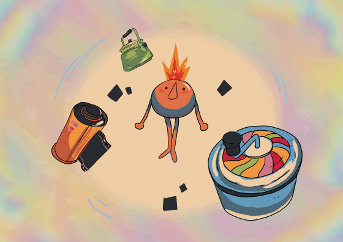

Cela fait cinq ans que tu as quitté la maison.  Cinq années à errer de ville en ville, de pays en pays — pour étudier, travailler, vivre.

Tu t’es peu à peu habitué(e) à cette vie sans ancrage. Au début, tu y voyais une liberté inédite. Mais plus le temps passait, plus une émotion difficile à nommer venait te hanter. 

Cette nuit-là, tu as fait un rêve étrange. Des souvenirs enfouis ont commencé à remonter à la surface...

Faite par l'équipe BYXQCUIP

Manuel : 

Saut : A / Space

Deplacement : Joysticks L / WASD

Pouvoir : Y / F

Interaction : X / E

